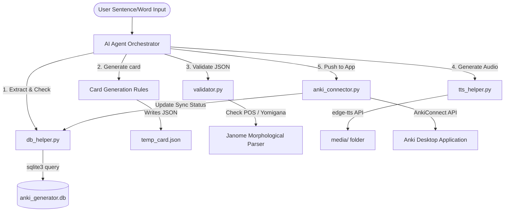

# Architecture & Component Flow

This document details the modular scripts in `src/anki_generator/skills/anki_card_generator/scripts/` and explains how they are organized to create the card generation pipeline.

---

## Component Details

### 1. Configuration (`src/anki_generator/config.py`)
Centralizes application settings, loading environment variables from `.env` with fallback defaults:
- **Paths**: Project root, SQLite DB path (`anki_generator.db`), and audio output directory (`media/`).
- **Anki Integration**: URL endpoint (default: `http://localhost:8765`) and target deck (default: `Japanese::Vocabulary`).
- **TTS**: Microsoft Edge voice profile (default: `ja-JP-NanamiNeural`).

### 2. Database Helper (`db_helper.py`)
Interacts with the local SQLite database (`anki_generator.db`) which serves as the "Source of Truth" for generated card histories:
- `--init`: Creates the `cards` table schema with validation, scheduling, and sync flags.
- `--check <word>`: Performs exact and wildcard lookup (e.g., `承る` matches `承る(うけたまわる)`) to prevent duplication.
- `--insert <path>`: Parses a JSON file to insert or replace card notes in the DB.

### 3. Validator (`validator.py`)
Enforces formatting standards and checks constraints before the card is pushed to Anki:
- **POS Format**: Enforces the structure `大분류(세부분류) - 활용/문법` using allowed tokens.
- **Language Isolation**: Uses regular expressions to ensure Japanese fields (front, target_word, root_id, components, collocations) do not accidentally contain Korean characters.
- **Yomigana Cross-Validation**: Uses `Janome` to parse the kanji portion of `root_id` and checks whether the resulting hiragana reading matches the provided parenthetical reading, flagging warnings on typos.

### 4. Text-to-Speech Helper (`tts_helper.py`)
Generates native Japanese pronunciation audio for the cards:
- Strips custom HTML formatting (such as tags marking target words) to ensure clean vocalization.
- Converts text asynchronously using Microsoft Edge's neural TTS engine.
- Saves files under the `media/` directory with md5-hashed names to prevent naming collisions.

### 5. Anki Connector (`anki_connector.py`)
Exposes integration utilities to communicate with the Anki Desktop App via `AnkiConnect`:
- Connects to the HTTP API to query active decks, create new decks dynamically, and upload media files (`storeMediaFile`).
- Formats notes to fit Anki's "Basic" note model, embedding the audio file tag `[sound:file.mp3]` into the Front field.
- Returns clean execution statuses (handling offline states gracefully) and writes updated synchronization attributes back to the card source JSON.
