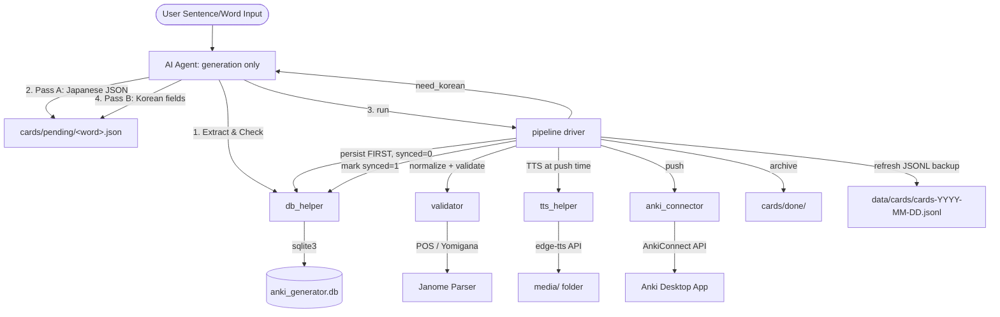

# Architecture & Component Flow

This document details the modular packages in `src/anki_generator/` and explains how they are organized to create the card generation pipeline.

The agent's role is deliberately reduced to **content generation**: it writes the working file
and reacts to the driver's structured responses (`regenerate` / `escalate` / `need_korean` /
`done`). Step ordering, the retry cap (hard max 3, tracked in the sidecar
`cards/pending/.attempts.json` so wholesale file rewrites cannot reset it), per-stage
preconditions, and DB-first persistence are all enforced in the `pipeline/` package — prose instructions
can be ignored by a model; code cannot be.

---

## Component Details

### 0. Pipeline Driver (`pipeline/`)
The deterministic orchestrator. Its subcommands sit directly under the `anki-gen` entry point:
- **`run <file>`**: normalize (kyujitai→shinjitai) → validate → Korean-pass gate → **DB persist first** (`synced_to_anki=0`) → Anki push with **TTS synthesized just before each note lands** (audio is made where it's pushed — cache-keyed on voice+text, so re-runs are free) + per-card `synced=1` marking (recording the returned Anki note id) → **backlog drain** (when Anki is reachable, any cards left pending by earlier offline sessions are pushed too, reported as `backlog_synced`) → **route Listening cards** into `ANKI_LISTENING_DECK` (reported as `routed_listening`; soft — never fails the push) → archive to `cards/done/` → refresh the `data/` JSONL backup. Emits a structured JSON status (`regenerate`/`escalate`/`need_korean`/`done`/`partial`) that is the agent's only interface. The retry cap (max 3) lives in the sidecar `cards/pending/.attempts.json` — outside the working file, so the agent rewriting the file cannot reset it; it clears once validation passes.
- **`sync-pending`**: recovery path — pushes DB cards with `synced_to_anki=0` (e.g. created while Anki was offline) and marks them synced. Since online `run`s drain the backlog automatically, this is only needed when no new card session is coming.
- **`sync-decks`**: routes the audio-first `Listening` cards out of the vocab deck into `ANKI_LISTENING_DECK` (`route_listening_cards()`). `run` and `sync-pending` already do this after pushing; the standalone command drains the one-time backlog when the `Listening` template is first added (it also *adds* the template via `connect_anki` → `ensure_note_model`) and lets the routing be re-run by hand. No DB involvement.
- **`backfill-audio`**: repairs **synced-but-silent notes** — finds synced DB rows with an empty `audio_path` (TTS failed at push time), synthesizes the audio, updates the note's `Audio` field via the stored `anki_note_id` (`updateNoteFields` — no other field is touched), then records the file in the DB. Cards are skipped (not half-fixed) while Anki is offline or when no note id was recorded, so a later run still finds them; pending cards are never touched — their audio is made at push time.
- **`doctor`**: end-to-end environment check (janome, joyokanji, edge-tts, DB schema, media dir, the gitignored `.agents/skills` skill symlink — forgotten on every fresh clone, so doctor points at `./setup_symlinks.sh` — DB↔JSONL parity for both cards and the known-words registry, AnkiConnect + note model). When Anki is reachable it also deep-checks that every note the DB believes is synced actually exists in this collection (`anki_notes` — catches an un-synced AnkiWeb state or notes deleted inside Anki). Anki being offline is a warning, not a failure.
- **`gc-media`**: deletes `media/*.mp3` referenced by neither the DB nor any pending working file.

### 1. Configuration (`src/anki_generator/config.py`)
Centralizes application settings, loading environment variables from `.env` with fallback defaults:
- **Paths**: Project root, SQLite DB path (`anki_generator.db`), audio output directory (`media/`), card working directories (`cards/pending/`, `cards/done/`), and the `data/` mirror directory — a clone of the separate private data repository (see *Multiple Machines*) — with centralized subdirectory helpers (`cards/`, `known_words/`; `attempts/` and `confusions/` reserved for the planned data-layer tables).
- **Anki Integration**: URL endpoint (default: `http://localhost:8765`), target deck (default: `Japanese::Vocabulary`), the listening-card deck `ANKI_LISTENING_DECK` (default: `Japanese::Listening` — set per-machine in `.env` alongside the vocab deck; its own new-cards/day limit throttles the listening backlog), note model override (`ANKI_NOTE_MODEL`), and the per-machine `ANKI_ENABLED` switch (`0` declares a generation-only machine — see *Offline Behavior*; `.env` is gitignored, so this is set once per machine).
- **TTS**: Microsoft Edge voice profile (default: `ja-JP-NanamiNeural`).

### 2. Database Helper (`db_helper/`)
Interacts with the local SQLite database (`anki_generator.db`) which serves as the "Source of Truth" for generated card histories:
- **Schema**: keyed on `UNIQUE(root_id, front)` — not `root_id` alone — so polysemous words can own one card per sense without clobbering each other. Re-inserting the same sense upserts in place, keeping the row id and (unless the card carries an explicit timestamp) its original `created_at`, so cards never drift between backup partitions. The card back is stored structurally (`back_reading` JA / `back_meaning` KO / `back_tip` KO); the combined Anki string is composed only at push time. `audio_path` holds a **bare file name** (resolved against `media/` on read) so the DB and its JSONL export survive repo moves; `anki_note_id` records the Anki note created at push time, keeping later note updates/deletes possible.
- **Auto-init/migration/reconcile**: every connection ensures the schema exists and transparently migrates both legacy layouts (`root_id PRIMARY KEY`, combined `back` column — split best-effort on `[뜻]`/`[Tip]` markers). The default DB **reconciles from the `data/cards/` JSONL partitions whenever they changed** (tracked by a name/mtime/size fingerprint in a `meta` table, so the steady-state cost is one `stat()` per file): a fresh clone rebuilds the DB, and a `git pull` that brought cards from another machine reaches the existing DB on its next touch — `db check` never reports pulled words as new. The reconcile merge keeps content fields local and merges **sync state monotonically** (`synced_to_anki` only ratchets up, `anki_note_id`/`audio_path` fill in when missing locally), so a stale partition can't downgrade a freshly synced row and a card pushed on another machine is never re-pushed here.
- **JSONL backup**: `export_cards()` **reconciles from the partitions first, then mirrors** the whole DB to `data/cards/cards-YYYY-MM-DD.jsonl` (daily partitions on `created_at` — bounded file sizes; deterministic ordering → minimal git diffs) — an export can only ever add to what git holds, never rewrite it down to a stale DB's state. Files the current partition scheme no longer produces are cleaned up after the reconcile, which is also how a scheme change (e.g. the 2026-07-15 monthly→daily switch) migrates itself on the first export. `import_cards_data()` is the full restore (JSONL wins). The pipeline refreshes the export after every persisting run. Consequence: dropping a DB row alone gets resurrected from git — real deletion is the future delete-sync flow's job (tombstones).
- **Sync tracking**: `mark_synced(root_id, front, note_id)` and `fetch_pending()` back the pipeline's DB-first ordering and the `sync-pending` recovery path.
- **Exposure cache** (`card_lemmas` table): the expensive half of the exposure counter — each card's content-word lemmas (Janome base forms of `back_reading`, bracket furigana stripped, grammar POS filtered), keyed on a hash of the extraction-rules version + `back_reading`. `refresh_card_lemmas()` is a lazy sweep run by consumers (e.g. `anki-gen legacy coverage`), never on the reconcile hot path: only missing/stale cards re-tokenize, and the hash makes it self-healing for cards that arrived via git. Pure derived data — no JSONL mirror, no doctor parity; the exposure *aggregate* is never stored at all (consumers join against `known_words` live), so registry changes reflect automatically and counters cannot drift.
- **Known-words registry** (`known_words` table): the legacy-deck snapshot written by `legacy_helper/` (see below), keyed on `(kind, word, source_deck)`. Only the stable fields (identity, status, lapses) are mirrored to `data/known_words/known_words-<source>.jsonl` — one partition per registered source (`source_deck` is part of the primary key, so rows never migrate between files; a date split would need a creation date the registry doesn't have) — while fast-drifting review stats (ease/ivl/reps) stay DB-local, with Anki as their source of truth. The mirror's git rhythm is one big initial commit, then small status diffs. Retirement carries write-once metadata (`retired_at`, `retired_reason` — 'promoted' / 'manual' / 'retirement-pass'), mirrored with NULL fields omitted so the learned majority stays compact. The registry rides the same reconcile-on-change (status ratchets to `retired`, lapses ratchet up, retirement metadata fills when locally missing but never overwrites a local stamp) and merge-then-mirror export as cards, so it travels to generation-only machines via git. Each row also carries a derived `norm_key` (root_id-shaped matching key — see §6) that is never mirrored: the code (`normalize_known_word`), not any stored copy, is its source of truth — it is recomputed on reconcile, backfilled for NULL rows on every connection, and fully rebuilt once when the normalizer's rules version (`_NORM_VERSION`) changes.
- CLI (`anki-gen db …`): `init`, `check <word>` (exact + kanji-part prefix lookup reporting **all** sense matches, plus a `known_legacy` block when the word already lives in the legacy decks), `insert <path>` (incomplete cards skipped and reported), `pending` (list unsynced cards), `export` / `import` (JSONL backup in both directions).

### 3. Validator (`validator/`)
Enforces formatting standards and checks constraints before the card is pushed to Anki:
- **POS Format**: Enforces the structure `大분류(세부분류) - 활용/문법` using allowed tokens.
- **Language Isolation (two-tier)**: With `--fix` (exposed as `anki-gen validate`), mechanically normalizes old-form / Korean-style hanja to Japanese shinjitai (`壓→圧`) using the `joyokanji` table plus a supplemental variant map, writes the file back, and reports the changes under `normalized`. Remaining Hangul in a Japanese field (front, target_word, root_id, components, collocations) is a hard failure flagged for field regeneration.
- **Target Marker Check**: Verifies that `front` marks the target word as `*word*` (plain text, no HTML) and that the marked text equals `target_word`.
- **Furigana Checks (mechanical)**: `back_reading` must carry bracket furigana on every kanji run (`決断[けつだん]`), each bracket must bind to a kanji-only base (a half-width space before the word keeps Anki's `{{furigana:}}` filter from swallowing preceding kana), and — brackets and spaces removed — it must equal `front` with its markers removed. All three are deterministic errors the regenerate loop can fix.
- **Yomigana Cross-Validation**: Uses `Janome` to parse the kanji portion of `root_id` and compares the predicted reading with the provided one. Mismatches surface under a separate `warnings` key and never flip `valid` to false — Janome's dictionary misses many N1/business words, and hard-failing on a possibly-correct reading would trap the agent in an unwinnable retry loop. The check is skipped entirely when Janome has no reading for a token.

### 4. Text-to-Speech Helper (`tts_helper/`)
Generates native Japanese pronunciation audio for the cards. Synthesis happens **at push
time**, on whichever machine pushes — generation never produces mp3s (media/ is
machine-local and would not travel with the git-carried cards anyway):
- **TTS speaks the card's own reading, never raw kanji**: the pipeline feeds
  `reading_to_kana(back_reading)` — each bracket-annotated word collapses to its
  validated reading (`傷[きず]は じきに` → `きずは じきに`), spaces surviving as
  segmentation hints. The engine re-guessing readings/boundaries from kanji text is
  what produced misreadings (傷はじきに → きず・はじき・に, 2026-07-14); kana-izing
  eliminates that class (homographs like 行った included). `front` remains only as a
  fallback for legacy rows without a structured reading.
- Strips card markup to ensure clean vocalization: HTML tags, `*target markers*`, and bracket furigana are removed (readings must not be spoken twice); ` ` becomes a space and HTML entities are decoded.
- Converts text asynchronously using Microsoft Edge's neural TTS engine; `synthesize()` is the synchronous entry point used by the pipeline.
- Output paths default to `media/tts_<md5 of voice + cleaned text>.mp3`, which doubles as a **cache key**: re-running the pipeline never re-synthesizes an existing (voice, sentence) pair, and switching voices never silently reuses old audio.
- Rejects empty post-cleaning text and zero-byte output files (removing partial files), so silent/dead audio never reaches a card.

### 5. Anki Connector (`anki_connector/`)
Exposes integration utilities to communicate with the Anki Desktop App via `AnkiConnect`:
- Connects to the HTTP API to query active decks, create new decks dynamically, and upload media files (`storeMediaFile`).
- **Repo-owned note model**: `ensure_note_model()` creates the `AnkiGen JA` model (fields `Front` / `Reading` / `Meaning` / `Tip` / `Audio` / `RootId` — the last is never rendered; it lets Anki-side features like leech rescue and flag harvesting identify the word without the note-id ↔ DB join) in Anki when missing and syncs its styling and templates from the git-managed `anki_model/` files whenever they drift — the repo, not the Anki profile, owns the card look. A same-named model with a foreign field layout is refused rather than mutated.
- **Two card templates on that one model**, both git-managed: **`Card 1`** (vocab — `front.html`/`back.html`) and **`Listening`** (audio-first — `front_listening.html`/`back_listening.html`, front = play button only, back reveals sentence + furigana + meaning). The listening front wraps everything in `{{#Audio}}…{{/Audio}}`, so a note with no audio grows **no** listening card — that conditional is the gate. Templates Anki is missing are **added** (`modelTemplateAdd`), never recreated, so retrofitting `Listening` onto an existing deck spawns its cards for every audio-carrying note at once while leaving the vocab cards and their review history untouched. `Card 1` stays ordinal 0.
- **Code-owned listening-deck routing** (`route_listening_cards()`): AnkiConnect exposes no per-template Deck Override, so a `Listening` card is born in the note's own deck (the vocab deck) and this sweep moves it to `ANKI_LISTENING_DECK` via `findCards`(`note:… deck:… card:"Listening"`) → `changeDeck`. Idempotent (a moved card no longer matches), so it doubles as the drain for the one-time backlog after the template is added. The listening deck's own new-cards/day limit throttles that backlog; sibling burying (note-scoped) keeps the vocab and listening cards of one word off the same day automatically.
- `push_card()` maps the structured card straight onto the note fields (no combined back string): the `*target*` marker in `front` becomes `` via `marker_to_html()`, `back_reading`'s bracket furigana is rendered as ruby by the `{{furigana:Reading}}` template filter, and audio lands in its own `Audio` field — **played on the back only** (user decision 2026-07-14: front-side autoplay interferes with practicing kanji reading; the answer side is where the sound belongs). Returns `('synced', note_id)` / `('duplicate', None)` (duplicates are treated as already-synced) or raises for per-card error recording; the note id is persisted to the DB so notes can be updated or deleted later.
- **`archive_notes()`** owns the archive primitive — suspend every card of the notes + tag `ankigen-retired` (with `ARCHIVE_TAG` and `cards_of_notes()` alongside). Legacy retirement delegates to it; leech rescue's retire option is expected to reuse it on AnkiGen's own cards.
- The standalone CLI (`anki-gen push-file <file>`) remains for manual pushes; the pipeline uses the same primitives with DB-first ordering.
- Emits diagnostics on stderr; stdout carries only the final JSON result for the orchestrating agent.

### 6. Legacy Migration Helper (`legacy_helper/`)
Deterministic mechanics for the shrink-first legacy-deck migration (strategy and
remaining plan: `docs/roadmap.md` → *Legacy Deck Migration*; shipped rounds and
settled decisions: `docs/history.md`). No LLM anywhere, and **nothing
about the user's collection is hardcoded** — the tools are generic, sources are
registered *data* (full spec per source in the DB `meta` table, `known_sources`), and
the *judgment* — which deck, what its fields mean — belongs to the agent conversation
(playbook: the `legacy_migration` skill's `SKILL.md`):
- **`list-decks`** / **`inspect-deck <deck>`**: the discovery pair — deck names with
  card counts, then one deck's card-state stats plus per-model field fill rates and
  sample values. This is what the agent reads to propose a snapshot mapping.
- **`snapshot`**: reads legacy decks through AnkiConnect into the `known_words`
  registry, then mirrors via the standard export path. Registering a deck passes
  `--deck/--model/--label/--kind` plus its field mapping (`--word-field/`
  `--reading-field/--meaning-field`, or `--group-field` for grammar-likes — many
  notes per expression collapse to one row); the spec is stored in `known_sources`,
  and **no arguments = refresh every registered source** (also how
  `retire-promoted` knows where any word's legacy notes live). Words keep their legacy
  surface form in `word` (retiring searches Anki by the original field value) and get
  a derived root_id-shaped **`norm_key`** (`咎める` + `とがめる` → `咎める(とがめる)`;
  deterministic format cleanup only: NFKC + wave-dash unification, first variant of
  multi-expression fields, annotation parens stripped, bracket-furigana readings
  collapsed — never kana→kanji resolution, which takes meaning-level judgment).
  Matching runs on that key in two confidence tiers: **exact** (root_id equals or
  extends the key — same base word, safe to act on) and **reading-only** (kana
  headword ↔ a root_id's reading part — a homophone card matches identically, so this
  tier always waits for a judgment call). Never-studied cards are
  excluded: not studied means not known. Re-runnable — stats refresh from Anki, but a
  `retired` status is never clobbered back to `learned`. Declines on `ANKI_ENABLED=0`
  machines.
- **`weak-queue`**: the promotion queue — `learned` words grouped across sources,
  filtered to `lapses >= N` (default 4), excluding words that already own an AnkiGen
  card, ranked worst-first (lapses desc, ease asc). Reads only the DB, so it works on
  Anki-less machines whose registry arrived via git.
- **`retire-promoted`**: the promotion closer — every `learned` registry word whose
  `norm_key` exact-matches a **synced** AnkiGen card gets its legacy notes archived
  (all duplicates found via live lookup, cards suspended, notes tagged
  `ankigen-retired`) and its registry rows flipped to `retired` (mirrored to git). An
  idempotent sweep, not a per-push hook — it also catches cards promoted from other
  machines. Reading-only matches come back as **`needs_review`** instead of being
  acted on; the agent/user compare meanings and close confirmed pairs with
  **`retire-word <word>`** (which doubles as the manual "I simply know this word"
  switch). Retiring stamps the write-once metadata: `retire-promoted` records
  `retired_reason='promoted'`, `retire-word` records `'manual'`. Needs Anki open.
- **`retired-list`**: audit view of the retirement ledger — retired words grouped
  across sources with when and why (`--reason` filters). Reads only the DB, so it
  works on Anki-less machines.
- **`coverage`**: the exposure report — refreshes the `card_lemmas` cache (lazy
  sweep, see `db_helper` above), then live-joins it against the registry per
  source/status. **Exact tier** (kanji lemma ↔ norm_key word part) counts as
  exposed; **reading_only** (kana↔kana — a homophone matches identically) is
  reported in its own column and never acted on. Also lists the top exact-exposed
  learned words — the evidence feed for the future retirement pass. DB-only.
- **`archive-duplicates`**: when a deck holds several notes per group-field value,
  keep the calmest one (fewest lapses, then longest interval — resets come from hard
  words in the example, so the least-troublesome example survives) and archive the
  rest. Dry-run by default, `--apply` to execute; parked notes are ignored; registry
  rows stay `learned` (the group is still known — it just owns one card). Applied to
  the 文法 decks (grouped by the 문법 field) on 2026-07-14: 2,091 cards archived,
  423 survivors.

Archive semantics everywhere: **suspend + tag `ankigen-retired`** — reversible,
review history preserved, single-sourced in `anki_connector.archive_notes()`
(`archive-duplicates` executes its user-approved dry-run plan card-by-card, but
shares the tag). Deletion is deliberately not implemented.

---

## Offline Behavior

Anki being closed is a normal state, not an error — **DB-first ordering makes the whole
generation flow independent of AnkiConnect**. The sync queue is the `synced_to_anki = 0`
flag in the DB itself (not the working file, not a separate queue file).

With Anki offline, `run` still completes: validation, the Korean pass, and DB
persistence all happen; the push — and TTS, which happens at push time — are skipped.
The working file is archived as usual and the `data/` JSONL export is refreshed — and
since the export mirrors every column including `synced_to_anki` and `anki_note_id`,
the *pending state itself* is git-backed: even on a fresh clone, auto-restore rebuilds
the DB and the unsynced cards are still known. The run reports `"anki_online": false`
plus an instruction to run `sync-pending` later.

A machine that will *never* run Anki can declare it: **`ANKI_ENABLED=0`** in its
(gitignored) `.env`. The pipeline then skips the connection attempt entirely, the run
message says committing & pushing the `data/` repo is all that's needed (instead of
telling the user to open Anki), `doctor` reports the Anki checks as intentionally disabled, and
`sync-pending`/`backfill-audio` decline with a pointer to an Anki-equipped machine.

Reconciliation is automatic: **the next `run` with Anki reachable drains the whole
backlog** after pushing its own cards (`backlog_synced` in the result), so deferred
syncs never depend on anyone remembering a command. **`anki-gen sync-pending`**
remains as the manual drain for when no new card session is coming. Both paths push
every `synced_to_anki = 0` card, upload its cached audio at push time, record the
returned note ids, and refresh the JSONL export — and both are idempotent: Anki's
duplicate detection (keyed on `Front`) is treated as already-synced, so re-running after
a partial failure never creates doubles. `doctor` reports Anki being offline as a
warning, never a failure.

TTS failures don't block any of this: edge-tts is a cloud API, and if synthesis fails
at push time the card syncs silent (`tts_warnings`) with its `audio_path` left empty —
**`anki-gen backfill-audio`** later synthesizes the audio and repairs the pushed
note in place.

---

## Multiple Machines

Cards — and the known-words registry, which rides the same rails — travel between
machines through **git** (the `data/` mirrors) and through **AnkiWeb** (the Anki
collection); the SQLite DB and `media/` stay local. `data/` is not part of this repo:
it is a **separate, private repository** cloned into the working tree (`./setup.sh
<data-repo-url>`) and gitignored here, so the code repo can stay public without
carrying personal card data. "Commit `data/`" therefore always means commit & push
*inside* that clone. Four mechanisms make the git leg safe:

1. **Reconcile-on-change** — after a `git pull`, the next DB touch merges the
   partitions in (see `db_helper` above). Machine B immediately knows machine A's
   words, `db check` stays accurate, and the monotonic sync-state merge means a card
   pushed on A is never re-pushed on B.
2. **Merge-then-mirror export** — an export can only add to `data/cards/`, so a stale DB can
   never rewrite git history away.
3. **Audio is made where it's pushed** — generation never synthesizes; the pushing
   machine runs TTS just before each note lands (the deterministic voice+text cache
   key makes re-runs free). A generation-only machine therefore produces no mp3s at
   all — nothing local is lost when cards travel. If synthesis fails at push time, the
   card pushes silent with `audio_path` left empty, so `backfill-audio` still finds it.
4. **Union merge for partitions** — the **data repo's** `.gitattributes` (materialized
   by `setup.sh` when missing) sets `*.jsonl` to `merge=union`: both machines appending
   cards to the same partition file no longer conflicts; the next run reconciles +
   re-exports a clean deterministic file. Safe because every file there is a
   reconcile-then-re-export mirror — duplicates and misordering never survive a run.

**One discipline rule remains: on a new machine, sync Anki (AnkiWeb) *before* the
first push.** Note-model creation is a collection schema change, and if two profiles
each create the model independently, the eventual AnkiWeb sync forces a full one-way
upload/download — picking the wrong direction there loses recent reviews. Once the
model exists everywhere, `ensure_note_model()` adopts it and only syncs drift.
`doctor`'s `anki_notes` check flags the symptom (synced cards whose notes are missing
from this collection) if the order was wrong.
