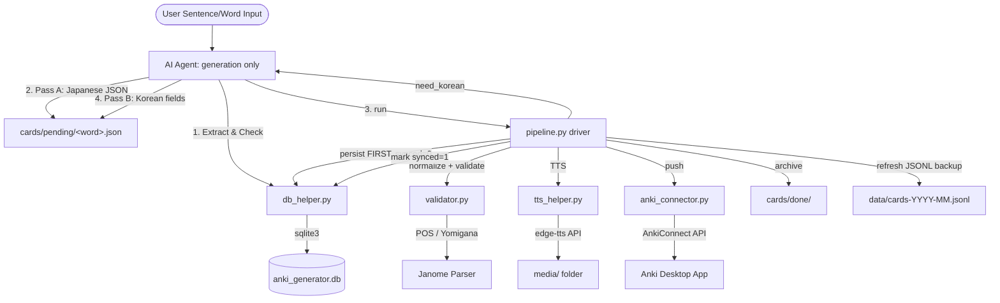

# Architecture & Component Flow

This document details the modular scripts in `src/anki_generator/skills/anki_card_generator/scripts/` and explains how they are organized to create the card generation pipeline.

The agent's role is deliberately reduced to **content generation**: it writes the working file
and reacts to the driver's structured responses (`regenerate` / `escalate` / `need_korean` /
`done`). Step ordering, the retry cap (hard max 3, tracked in the sidecar
`cards/pending/.attempts.json` so wholesale file rewrites cannot reset it), per-stage
preconditions, and DB-first persistence are all enforced in `pipeline.py` — prose instructions
can be ignored by a model; code cannot be.

---

## Component Details

### 0. Pipeline Driver (`pipeline.py`)
The deterministic orchestrator. Subcommands:
- **`run <file>`**: normalize (kyujitai→shinjitai) → validate → Korean-pass gate → TTS (content-hash cached) → **DB persist first** (`synced_to_anki=0`) → Anki push + per-card `synced=1` marking (recording the returned Anki note id) → archive to `cards/done/` → refresh the `data/` JSONL backup. Emits a structured JSON status (`regenerate`/`escalate`/`need_korean`/`done`/`partial`) that is the agent's only interface. The retry cap (max 3) lives in the sidecar `cards/pending/.attempts.json` — outside the working file, so the agent rewriting the file cannot reset it; it clears once validation passes.
- **`sync-pending`**: recovery path — pushes DB cards with `synced_to_anki=0` (e.g. created while Anki was offline) and marks them synced.
- **`doctor`**: end-to-end environment check (janome, joyokanji, edge-tts, DB schema, media dir, AnkiConnect + note model). Anki being offline is a warning, not a failure.
- **`gc-media`**: deletes `media/*.mp3` referenced by neither the DB nor any pending working file.

### 1. Configuration (`src/anki_generator/config.py`)
Centralizes application settings, loading environment variables from `.env` with fallback defaults:
- **Paths**: Project root, SQLite DB path (`anki_generator.db`), audio output directory (`media/`), and card working directories (`cards/pending/`, `cards/done/`).
- **Anki Integration**: URL endpoint (default: `http://localhost:8765`), target deck (default: `Japanese::Vocabulary`), and note model override (`ANKI_NOTE_MODEL`).
- **TTS**: Microsoft Edge voice profile (default: `ja-JP-NanamiNeural`).

### 2. Database Helper (`db_helper.py`)
Interacts with the local SQLite database (`anki_generator.db`) which serves as the "Source of Truth" for generated card histories:
- **Schema**: keyed on `UNIQUE(root_id, front)` — not `root_id` alone — so polysemous words can own one card per sense without clobbering each other. Re-inserting the same sense upserts in place, keeping the row id and (unless the card carries an explicit timestamp) its original `created_at`, so cards never drift between monthly backup partitions. The card back is stored structurally (`back_reading` JA / `back_meaning` KO / `back_tip` KO); the combined Anki string is composed only at push time. `audio_path` holds a **bare file name** (resolved against `media/` on read) so the DB and its JSONL export survive repo moves; `anki_note_id` records the Anki note created at push time, keeping later note updates/deletes possible.
- **Auto-init/migration/restore**: every connection ensures the schema exists and transparently migrates both legacy layouts (`root_id PRIMARY KEY`, combined `back` column — split best-effort on `[뜻]`/`[Tip]` markers). A **missing default DB is rebuilt automatically from the `data/` JSONL partitions** — on a fresh clone, `--check` must not silently report every known word as new.
- **JSONL backup**: `export_cards()` mirrors the whole DB to `data/cards-YYYY-MM.jsonl` (partitioned on `created_at`, deterministic ordering → minimal git diffs); `import_cards_data()` is the idempotent inverse. The pipeline refreshes the export after every persisting run.
- **Sync tracking**: `mark_synced(root_id, front, note_id)` and `fetch_pending()` back the pipeline's DB-first ordering and the `sync-pending` recovery path.
- CLI: `--init`, `--check <word>` (exact + kanji-part prefix lookup reporting **all** sense matches), `--insert <path>` (incomplete cards skipped and reported), `--pending` (list unsynced cards), `--export` / `--import` (JSONL backup in both directions).

### 3. Validator (`validator.py`)
Enforces formatting standards and checks constraints before the card is pushed to Anki:
- **POS Format**: Enforces the structure `大분류(세부분류) - 활용/문법` using allowed tokens.
- **Language Isolation (two-tier)**: With `--fix`, mechanically normalizes old-form / Korean-style hanja to Japanese shinjitai (`壓→圧`) using the `joyokanji` table plus a supplemental variant map, writes the file back, and reports the changes under `normalized`. Remaining Hangul in a Japanese field (front, target_word, root_id, components, collocations) is a hard failure flagged for field regeneration.
- **Target Marker Check**: Verifies that `front` marks the target word as `*word*` (plain text, no HTML) and that the marked text equals `target_word`.
- **Furigana Checks (mechanical)**: `back_reading` must carry bracket furigana on every kanji run (`決断[けつだん]`), each bracket must bind to a kanji-only base (a half-width space before the word keeps Anki's `{{furigana:}}` filter from swallowing preceding kana), and — brackets and spaces removed — it must equal `front` with its markers removed. All three are deterministic errors the regenerate loop can fix.
- **Yomigana Cross-Validation**: Uses `Janome` to parse the kanji portion of `root_id` and compares the predicted reading with the provided one. Mismatches surface under a separate `warnings` key and never flip `valid` to false — Janome's dictionary misses many N1/business words, and hard-failing on a possibly-correct reading would trap the agent in an unwinnable retry loop. The check is skipped entirely when Janome has no reading for a token.

### 4. Text-to-Speech Helper (`tts_helper.py`)
Generates native Japanese pronunciation audio for the cards:
- Strips card markup to ensure clean vocalization: HTML tags, `*target markers*`, and bracket furigana are removed (readings must not be spoken twice); ` ` becomes a space and HTML entities are decoded.
- Converts text asynchronously using Microsoft Edge's neural TTS engine; `synthesize()` is the synchronous entry point used by the pipeline.
- Output paths default to `media/tts_<md5 of voice + cleaned text>.mp3`, which doubles as a **cache key**: re-running the pipeline never re-synthesizes an existing (voice, sentence) pair, and switching voices never silently reuses old audio.
- Rejects empty post-cleaning text and zero-byte output files (removing partial files), so silent/dead audio never reaches a card.

### 5. Anki Connector (`anki_connector.py`)
Exposes integration utilities to communicate with the Anki Desktop App via `AnkiConnect`:
- Connects to the HTTP API to query active decks, create new decks dynamically, and upload media files (`storeMediaFile`).
- **Repo-owned note model**: `ensure_note_model()` creates the `AnkiGen JA` model (fields `Front` / `Reading` / `Meaning` / `Tip` / `Audio` / `RootId` — the last is never rendered; it lets Anki-side features like leech rescue and flag harvesting identify the word without the note-id ↔ DB join) in Anki when missing and syncs its styling and templates from the git-managed `anki_model/` files (`style.css`, `front.html`, `back.html`) whenever they drift — the repo, not the Anki profile, owns the card look. A same-named model with a foreign field layout is refused rather than mutated.
- `push_card()` maps the structured card straight onto the note fields (no combined back string): the `*target*` marker in `front` becomes `` via `marker_to_html()`, `back_reading`'s bracket furigana is rendered as ruby by the `{{furigana:Reading}}` template filter, and audio lands in its own `Audio` field. Returns `('synced', note_id)` / `('duplicate', None)` (duplicates are treated as already-synced) or raises for per-card error recording; the note id is persisted to the DB so notes can be updated or deleted later.
- The standalone CLI (`anki_connector.py <file>`) remains for manual pushes; the pipeline uses the same primitives with DB-first ordering.
- Emits diagnostics on stderr; stdout carries only the final JSON result for the orchestrating agent.
