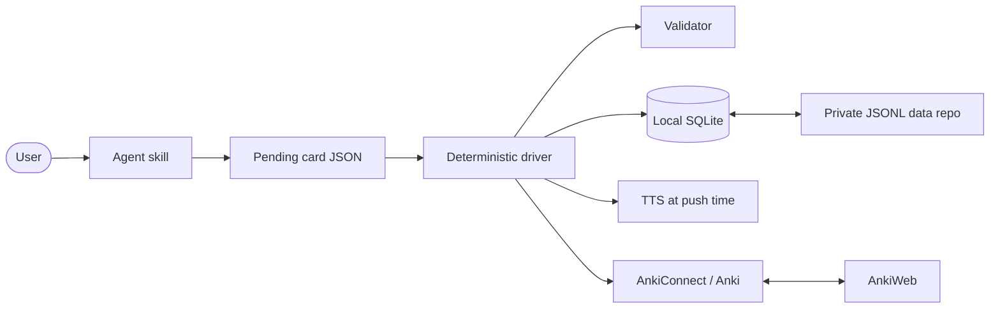

# Architecture Overview

This document is the entry point for the system's **current** architecture. It explains
the boundaries and invariants needed to change the code safely; detailed command usage
belongs in `docs/user_guide/` and `anki-gen --help`, while decision rationale belongs in
`docs/decisions/`.

## System flow

The agent produces content and judgment. Python drivers own ordering, validation,
persistence, retry limits, synchronization, and machine-readable responses. This keeps
control flow enforceable even when prose instructions are misunderstood.

## Boundaries

- **Agent skills** under `src/anki_generator/skills/` are markdown playbooks. They do not
  contain or own Python code.
- **Skill drivers** (`pipeline`, `legacy_helper`, `practice_helper`, `rescue_helper`)
  orchestrate use cases. A driver may import the shared platform but never another skill's
  driver.
- **Shared platform packages** (`db_helper`, `anki_connector`, `tts_helper`, `validator`,
  `schemas`, `common`) own reusable mechanics and cross-skill contracts.
- **Persistence boundaries** keep connection lifecycle in `db_helper.session`, while SQL
  serving one skill lives in that skill package's `repository.py`. Repositories never own
  commits; the orchestrating use case chooses the transaction boundary.
- **SQLite** is the local operational source of truth. The private `data/` repository is
  its deterministic, mergeable, cross-machine mirror.
- **Anki** is the study surface and owns review state. It is not the source of truth for
  generated content or practice-process data.

See [skill drivers](architecture/skill-drivers.md),
[data and synchronization](architecture/data-and-sync.md), and
[Anki integration](architecture/anki-integration.md) for the domain details.

## Architectural invariants

- Persist cards before attempting an Anki push; Anki being closed is a normal state.
  See [ADR-0001](decisions/0001-db-first-offline-pipeline.md).
- Reconcile mirror input before export, and merge sync/archive state monotonically.
  See [ADR-0002](decisions/0002-merge-then-mirror-sync.md).
- Keep personal data in the separate private `data/` repository.
  See [ADR-0003](decisions/0003-separate-private-data-repository.md).
- Use natural identity for mergeable entities and UUIDs for events without a natural key.
  See [ADR-0004](decisions/0004-identity-by-data-semantics.md).
- Archive user study material reversibly; durable deletion requires tombstones.
  See [ADR-0005](decisions/0005-reversible-archive.md).
- Treat the git-owned Anki note model as application code.
  See [ADR-0006](decisions/0006-repository-owned-anki-model.md).
- Keep orchestration in thin skill drivers over a shared platform.
  See [ADR-0007](decisions/0007-shared-platform-and-skill-drivers.md).
- Card identity uses the dictionary kanji headword; a hyōgai target's card surface is
  kana, `is_hyogai` is validator-computed (never model-asserted), and kanji recognition
  is a separate flag-free card throttled by `hyogai_priority`.
  See [ADR-0009](decisions/0009-kanji-root-identity-kana-surface.md).
- Select one TTS provider explicitly and require valid audio before an Anki push.
  See [ADR-0010](decisions/0010-explicit-fail-closed-tts-provider.md).
- Edit a card in place — DB row, JSONL mirror, and (best-effort) the live note via the one
  shared `updateNoteFields` primitive — rather than re-queueing it; deletion stays out of
  scope. See [ADR-0012](decisions/0012-in-place-card-edits.md).
- Teach the isolated-kanji on/kun reading map in a separate repo-owned deck keyed by the
  kanji itself, where the official on-yomi count is the difficulty boundary and readings
  outside the 音訓表 are never counted.
  See [ADR-0011](decisions/0011-single-kanji-reading-acquisition.md).

## Runtime modes

On an Anki-equipped machine, a pipeline run persists the card, synthesizes audio, pushes
the note, records its Anki note id, drains older pending rows, routes listening and hyōgai
recognition cards into their decks, and refreshes the mirror. When Anki is unavailable, the same run completes through persistence
and mirror export; a later online run drains the backlog.

A generation-only machine sets `ANKI_ENABLED=0`. It never attempts Anki operations and
shares work through the private data repository. On a new Anki machine, sync AnkiWeb before
the first push so the existing note-model identity is adopted safely.

## Documentation contract

Update this architecture when a component boundary, data owner, flow, or invariant changes.
Do not add release chronology, pending work, or rejected alternatives here. Those belong in
the [roadmap](roadmap.md), an [ADR](decisions/README.md), or Git history.
